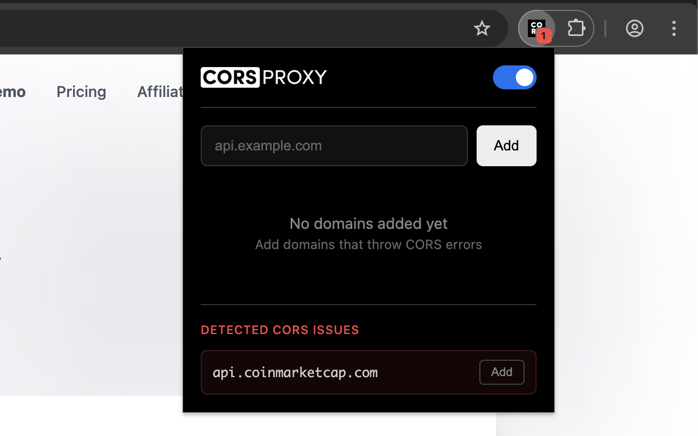
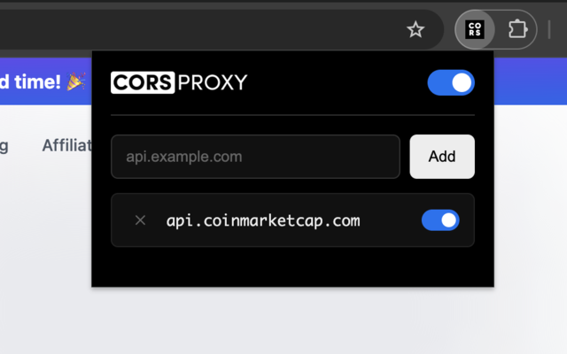

# CORSPROXY - Chrome Extension for CORS Error Bypass

A lightweight Chrome extension that automatically routes requests through a CORS proxy for specified domains. Perfect for developers working with APIs that don't support CORS.

<table>
  <tr>
    <td></td>
    <td></td>
  </tr>
</table>

## Features

- **One-Click CORS Fix** - Add domains that throw CORS errors and they're automatically proxied
- **URL Encoding** - Properly encodes URLs for reliable proxy routing
- **Per-Domain Toggle** - Enable/disable proxying for individual domains
- **Global Toggle** - Quickly enable/disable all proxying
- **Minimal Footprint** - Only intercepts requests to domains you specify
- **Dark Mode UI** - Clean, modern interface

## Installation

### From Source

1. Clone this repository
2. Run `bun install` to install dependencies
3. Run `bun run build` to build the extension
4. Open `chrome://extensions/` in Chrome
5. Enable "Developer mode" (top right)
6. Click "Load unpacked" and select the `dist` folder

## Usage

1. Click the CORSPROXY extension icon in your toolbar
2. Enter a domain that's causing CORS errors (e.g., `api.example.com`)
3. Click "Add"
4. Reload the page making the request

Requests to that domain will now be routed through `corsproxy.io`.

## How It Works

When you add a domain, CORSPROXY intercepts `fetch` and `XMLHttpRequest` calls to that domain and redirects them through:

```
https://corsproxy.io/?url=https%3A%2F%2Fapi.example.com%2Fendpoint
```

The proxy adds the necessary CORS headers, allowing your browser to receive the response.

## Example

**Before (CORS Error):**
```
Access to fetch at 'https://api.example.com/data' from origin
'http://localhost:3000' has been blocked by CORS policy
```

**After (Works):**
```javascript
// Your code stays the same
fetch('https://api.example.com/data')
  .then(res => res.json())
  .then(data => console.log(data));

// CORSPROXY automatically routes through proxy
// Console shows: [CORSPROXY] api.example.com
```

## Requirements

- Google Chrome (Manifest V3 compatible)
- Bun (for building from source)

## Privacy

- No data is collected or transmitted except through the CORS proxy
- Domain list is stored locally in Chrome storage
- Extension only activates on domains you explicitly add

## Development

See [Developer Documentation](./docs/README.md) for build instructions and architecture details.

## License

This project is licensed under the GNU General Public License v3.0 - see the [LICENSE](LICENSE) file for details.

Copyright (c) 2026 corsproxy.io

## Keywords

CORS, CORS error, CORS proxy, Chrome extension, cross-origin, API proxy, fetch proxy, XMLHttpRequest proxy, developer tools, web development, CORS bypass, corsproxy.io
